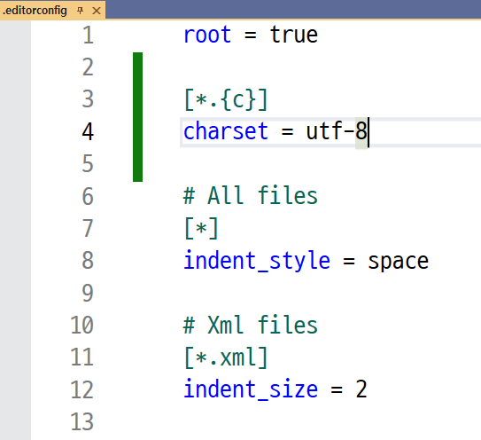

# iot-c-2025
 c언어 학습 리포지토리

# 1일차
- 주석 : ctrl + /
    - 주석 넣기 : ctrl + k + c
    - 주석 빼기 : ctrl + k + u

- VScode에서 c파일의 한글이 깨진다면
    - utf - 8을 기본으로 인코딩 세팅
    1. 솔루션 탐색기의 프로젝트 이름을 우클릭
    2. 추가 > New EditorConfig
    3. 생성된 .editorconfig 파일 다음과 같이 수정

    

- 기초적인 C언어 틀 : [C](./Day01/HelloWorld.c)

    ```c
    #define _CRT_SECURE_NO_WARNINGS // scanf 에러 나는 경우
    #include <stdio.h>     // 헤더파일
    /* 출력 함수 이름(입력)*/
    int main()      // 함수 앞 단어 : 출력 되는 자료형(int, void, ...,)
    {
        return 0;   // 운영체제로 반환. void일 때에는 return 없음.
    }
    ```

- 10진수와 16진수 : [C](./Day01/printf.c)
    - 10진수 : 0 ~ 9
    - 16진수 : 0 ~ 9 + a ~ f
    10진수 15 >> 2진수 1111 >> 16진수 f
    10진수 156 >> 2진수 1001 1100 >> 16진수 9c 
    16진수 f로 나타낼 수 있는 최대가 2진수 1111이므로 4자리씩 나누어서 변환

- 포맷 지정자 [C](./Day01/printf2.c)
    - %f : 기본 소수점 형식     
    printf("%f", 3.14159); → 3.141590
    - %lf : double을 위한 지정자    
    printf("%lf", 3.14159); → 3.141590
    - %.nf : 소수점 n자리까지 제한 
    printf("%.2f", 3.14159); → 3.14
    - %d : 부호 있는 정수(signed int) 출력 
    printf("%d", -10); → -10
    - %i : %d와 동일 
    printf("%i", 42); → 42
    - %u : 부호 없는 정수(unsigned int) 출력
    printf("%u", 100); → 100
    - %c : 단일 문자 출력 
    printf("%c", 'A'); → A
    - %s : 문자열 출력
    printf("%s", "Hello"); → Hello
    - %x : 16진수
    - %o : 8진수
    - %p : 포인터 주소값
    - %e : 지수 표기법

- 변수 생성 : [C](./Day01/value.c)
    ```c
    #include <stdio.h>
    int main()
    {
        int num;    // 자료형 변수명
        num = 10;
        int num2 = 10;	// 변수의 초기화
        char ch = 'A';	// 문자 타입의 변수 선언
        double db = 3.14;
        char str[10] = "banana";   // 문자타입 배열 선언

        return 0;
    }
    ```
    - 변수에 집어넣는값 : 리터럴
    - int : 정수
    - double : 실수
    - char : 문자
    - str : 문자열 [C](./Day01/value4.c)

- char : [C](./Day01/value2.c)
    - 1바이트(8비트) 크기     1111 1111 = 255
    - signed char : 부호가 있는 1바이트 정수형 데이터 타입
        - -128 ~ 127 (0이 있기에 양수는 127까지)
    - unsigned char : 부호 없는 1바이트 정수형 데이터 타입
        - 0 ~ 255

- for문 : [C](./Day01/value5.c)
    ```c
    for (초기화; 조건; 증감) {
    // 반복할 코드
    }
    ```
    - i++ 는 i = i + 1 과 같음

- const : [C](./Day01/value6.c)
    - 변수의 이름을 상수화 시킴
    - 원래 상수화 시키고 값을 바꿀 수 없지만 포인터를 사용하여 간접 참조하여 값을 변경할 수 있음

- 입력
    - scanf : [C](./Day01/scanf.c)
        - 변수를 하나 생성하고 scanf로 수를 입력받아서 변수에 저장
        - 이때 scanf에서 키보드를 통해 입력받는 곳은 변수와 다름
        - 따라서 주소 연산자(&)를 통해서 변수의 주소를 가져다 줘야함
        - 크기 제한을 확인하지 않아 버퍼 오버플로우 발생 가능

    - scanf_s : [C](./Day01/scanf2.c)
        - str은 이미 주소이기 때문에 주소 연산자(&)를 쓰지 않아도 됨
        - 추가적인 크기 인자 필요(버퍼 오버플로우 방지)
        - `연산자 sizeof() 를 통해 입력 크기의 제한을 걸어줌`

# 2일차
- 논리연산자와 비트연산자 : [C](./Day02/oper.c)
    - A && B : 논리합. A 와 B 가 모두 참이여야 참
        ```c
        int n = 30;
        int res;

        res = (n > 10) && (n < 20);
        printf("res: %d\n", res); // res = 0 , 0이면 거짓, 0을 제외한 -1, 1, ...는 참
        ```

    - A & B : 비트 연산자. A와 B의 같은 자리 비트가 모두 1이면 1, 아니면 0
        ```c
        int a = 5, b = 3;  // 5 = 0101, 3 = 0011 (2진수)
        int result = a & b; // 0001 (1)
        printf("%d\n", result);  // 1 출력
        ```
    - A || B : 논리합. A 또는 B 중 하나라도 참이면 참

        ```c
        res = (n > 10) || (n < 20);
        printf("res: %d\n", res);
        ```

    - A | B : 비트 연산자. A와 B의 같은 자리 비트 중 하나라도 1이면 1
        ```c
        int a = 5, b = 3;  // 5 = 0101, 3 = 0011 (2진수)
        int result = a | b; // 0111 (7)
        printf("%d\n", result);  // 7 출력
        ```
    - ! : 참을 거짓으로, 거짓을 참으로
        ```c
        res = !(n >= 30);
        printf("res: %d\n", res);
        ```
    - ~ : 비트 연산자. 비트 0을 1로, 1을 0으로
        ```c
        res = ~n;
        printf("res: %d\n", res);
        ```
    - >> : 비트 연산자 : [C](./Day02/shift.c)
- \n
    - 이 과정에서 엔터를 치면 버퍼에 \n이 남음 >> a = 10, ch = '\n'
    ```c
    int a;
    char ch;
    scanf("%d", &a);
    scanf("%c", &ch);
    ```

    - 해결 방법 1
    ```c
    int a;
    char ch;
    scanf("%d", &a);
    getchar();  // 개행 문자 제거
    scanf("%c", &ch);

    ```

    - 해결 방법 2
    ```c
    int a;
    char ch;
    scanf("%d", &a);
    scanf(" %c", &ch); // 앞에 띄어쓰기 추가
    ```

- 형 변환 : [C](./Day02/casting.c)
    - 형 변환 시점에 따라 결과값이 달라짐

- 삼항 연산자 : [C](./Day02/oper2.c)
    - 형식 : (조건) ? 참일때 : 거짓일때

- 전위&후위 연산자 : [C](./Day02/oper2.c)
    - res = n++
        1. res = n     
        2. n = n+1
    - res = ++n
        1. n = n+1      
        2. res = n

- 제어문 [C](./Day02/제어문.c)
    - 선택제어문
        - if : [C](./Day02/if.c)
        ```c
        #include <stdio.h>

        int main()
        {
            if (조건) {
                // continue; 가 있으면 결과1은 건너뛰기
                결과1;
            }
            else {
                결과;
            }
            return 0;
        }
        ```
        - switch 
        ```c
        switch(표현식) {
            case 상수1:
            실행 코드 1;
            break;  // break가 없으면 case 2, 3도 다 실행
            case 상수2:
            실행 코드 2;
            break;
            case 상수3:
            실행 코드 3;
            break;
            default:
            표현식과 일치하지 않을 때 실행 코드;
            break;
        }
        ```

    - 반복제어문
        - for
        ```c
        for (변수형 초기값; 조건; 증감) {   // i++ : i = i + 1 을 뜻함
            실행할 코드;
        }
        ```
        - while [C](./Day02/while.c)
        ```c
        while (조건) {          // 조건을 1로 설정하면 무한루프
            조건이 참일 때 반복 실행할 코드;
                                // break;
        }
        ```

- 실습
    - 구구단 : [C](./Day02/구구단.c)
    - 계산기 : [C](./Day02/계산기.c)

# 3일차
- 배열 : [C](./Day03/array.c)
    - 동일한 자료를 연속적으로 가지고 있음
    - 수정이 어려움 : 자료가 연속적으로 있어야하므로 삭제나 수정 시 인덱스 변경이 필요!
    - 자료 검색이 쉬움 : 인덱스라는 개념이 있어 검색에 용이
    
    - 배열의 주소 : [C](./Day03/array2.c)
    - 배열의 이름은 주소를 뜻함(자료를 입력 받을 때 주소 연산자& 필요없음)
    - 배열의 각 방은 변수로 보기 때문에 각 방에 입력을 받게 되면 주소 연산자& 필요
    - 배열의 이름(주소)와 배열의 첫번째 방 주소는 같음
    
    - char 배열 : [C](./Day03/array3.c)
        - 문자열 끝에는 끝났다는 걸 알려주기 위한 null 정보가 필요하므로 + 1 만큼의 방이 필요
        - 남은 문자열에는 모두 null이 들어있음
        - 배열에 직접 문자열 삽입 시 null 부재 >> '\0' 따로 추가

- 연결 리스트
    - 1번 자료가 2번 자료의 포인터를 가지고 있음
    - 수정이 쉬움 : 포인터의 연결만 끊고 추가나 수정, 삭제가 가능
    - 자료 검색이 어려움 : 인덱스가 없어서 차례대로 자료를 검색해야함

- 주소 
    - 메모리에서 특정 변수나 데이터가 저장된 위치

- 포인터 : [C](./Day03/pointer.c)
    - 포인터는 주소를 저장하는 `변수`
    - 간접 참조
- 포인터와 주소의 크기 : [C](./Day03/pointer2.c)
    - 주소의 크기는 컴퓨터 환경에 따라 다름(64비트 컴퓨터 기준 8바이트)
    - 포인터 변수의 크기는 타입에 상관없이 일정함. 이유는 주소의 크기가 일정하기 때문

- 배열과 포인터 : [C](./Day03/pointer5.c)
    - 배열 주소를 포인터에 할당 후
    - 포인터 + 0 과 포인터 + 1 을 비교하면 주소가 4 차이남(값이 int라서)
    - *(포인터 + n) = 값 을 통해서 (포인터 + n) 자체에 값 할당
    - `포인터[n] 와 *(포인터 + n)은 똑같음`

- 사용자 정의 함수
    - 컴파일러는 순차적으로 명령을 실행하기에 메인함수에 사용자 지정 함수를 사용할 것이라면 그전에 함수 선언을 해야함.

    - swap 함수 : [C](./Day03/pointer4.c)
        - 함수 호출 시 값 복사가 이루어지기 때문에 함수에서 값이 바뀐다 하더라도 원래의 값이 바뀌지 않음
        - 포인터를 사용해서 값 자체를 바꿔줘야함

    - printAry, inputAry ; [C](./Day03/pointer6.c)

- const : [C](./Day03/pointer7.c)
    - const int* pnum1 → 데이터 상수화(가리키는 값 변경 불가, 포인터 주소 변경 가능)
    - int* const pnum2 → 포인터 상수화(가리키는 값 변경 가능, 포인터 주소 변경 불가)

- 문자 전용 함수 : [C](./Day03/char2.c)
    - getchar : 한 문자를 읽어오는 함수.
    - putchar : 한 문자를 출력하는 함수. 

- 대소문자를 반환해주는 프로그램 : [C](./Day03/char3.c)

# 4일차
- 사용자 정의 함수
    - myStrInput : [C](./Day04/char4.c)
        - 문자를 입력 받아서 문자열을 출력하는 함수
        - 엔터 시 종료, 문자가 배열 크기를 넘지 않도록

- 메모리 : 
    - 코드 세그먼트 : 프로그램의 실행 코드가 저장되는 영역

    - 데이터 세그먼트 : 프로그램에서 사용하는 전역 변수 및 정적 변수가 저장되는 영역
        - 힙 : 사용자에게 할당된 메모리 영역
        - stack : 지역 변수, 매개 변수
        - data : 전역변수, static
        - rod : 문자열 상수, 리터럴

- 문자열
    - 문자열 상수 [C](./Day04/string2.c)
        - 문자열 상수 = 주소
        - 문자열 리터럴은 읽기 전용 메모리에 저장되어 있어 수정 불가
        - 문자열을 배열로 선언 시 수정 가능 [C](./Day04/string.c)

    - 문자 전용 입력 함수 : [C](./Day04/string3.c)
        - gets : 공백을 포함. 버퍼 오버플로우 가능성
        - fputs : 공백을 포함. 개행 문자 포함 가능

    - 문자 전용 출력 함수 : [C](./Day04/string4.c)
        - puts : 자동으로 개행
        - fputs : 개행 x

    - 문자열 관련 함수
        - 문자열 복사 : [C](./Day04/strcpy.c)
            - strcpy 함수 
            ```c
            strcpy(str, str2); // str에 str2 복사
            strncpy(str, str2, n); // str에 str2의 n글자 복사
            ```
            - 사용자 정의 함수 myStrCopy : [C](./Day04/strcpy.c)

        - 문자열 길이 : [C](./Day04/strlen.c)
            - strlen 함수 
        
        - 문자열 연결 : [C](./Day04/strcat.c)
            - strcat 함수 
            ```c
            strcat(str, str2); // str에 str2 연결 후 반환
            strncat(str, str2, n); // str에 str2의 n글자 연결 후 반환
            ```
        - 문자열 비교 : [C](./Day04/strcmp.c)
            - strcmp 함수
            ```c
            strcmp(str, str2);
            // str 이 사전에서 먼저 나오면 -1 반환, str2가 먼저 나오면 1 반환, 같으면 0을 반환
            strncmp(str, str2, n);
            // 첫 n글자 비교
            ```
- 변수
    - 전역 변수 : [C](./Day04/value.c)
        - 함수 밖에서 선언
        - 프로그램 실행 시 한번만 초기화되고 값을 계속 유지
        - 프로그램 종료 시까지 유지
        - 모든 파일에서 접근 가능(외부파일도 포함)

    - 정적 전역 변수
        - 함수 밖에서 static 과 함께 선언
        - 프로그램 실행 시 한번만 초기화되고 값을 계속 유지
        - 프로그램 종료 시까지 유지
        - 선언된 파일 내부에서만 접근 가능

    - 지역 변수 
        - 함수 내에서 선언
        - 함수가 호출될 때마다 초기화
        - 함수가 실행될 때 생성, 함수 종료 시 소멸
        - 선언된 함수 내부에서만 접근 가능

    - 정적 지역 변수 : [C](./Day04/value2.c)
        - 함수 내에서 static 과 함께 선언
        - 프로그램 실행 시 한 번만 초기화되고 값을 계속 유지
        - 프로그램 종료 시까지 유지
        - 선언된 함수 내부에서만 접근 가능

- 2차원 배열 - (대부분 for문)
    - 입력 방식 : [C](./Day04/array.c)
    - int 형 2차원 배열 : [C](./Day04/array2.c)
    - char 형 2차원 배열 : [C](./Day04/array3.c)

- 포인터와 배열
    - 포인터 배열 : [C](./Day04/pointerArray.c)
        - `배열(포인터를 저장할 수 있는 배열)`
    - 배열 포인터 : [C](./Day04/arrayPointer.c)
        - `포인터(배열을 가리키는 포인터)`


- 2중 포인터 : [C](./Day04/dpointer.c)
    ```c
    int n = 100;           
    int* pn;
    int** ppn;                  // 2중 포인터

    pn = &n;                    // 변수 n의 주소를 저장
    ppn = &pn;                  // 포인터 변수 pn의 주소를 저장
    // n == *pn == **ppn
    // &n == pn == *ppn
    // &pn == ppn
    ```
    - 이중 포인터 써보기 [C](./Day04/dpointer2.c)
        - 배열은 이미 주소이므로 *배열은 이중포인터